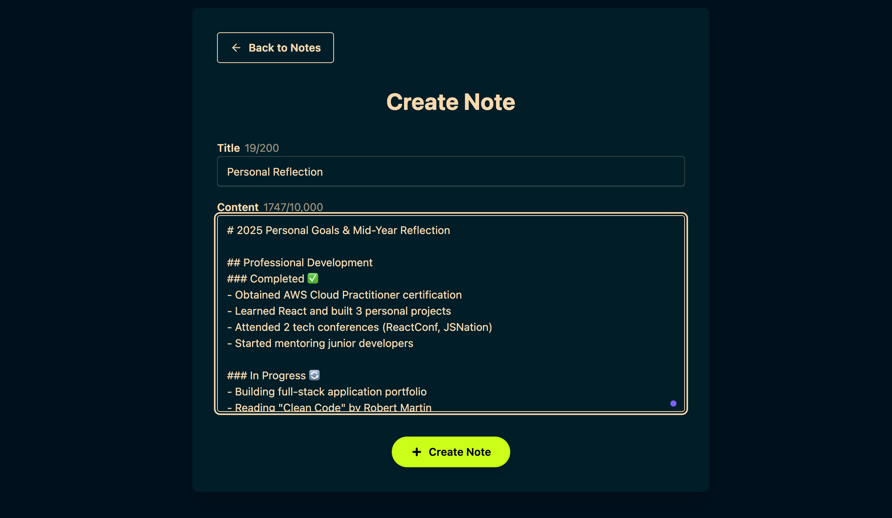
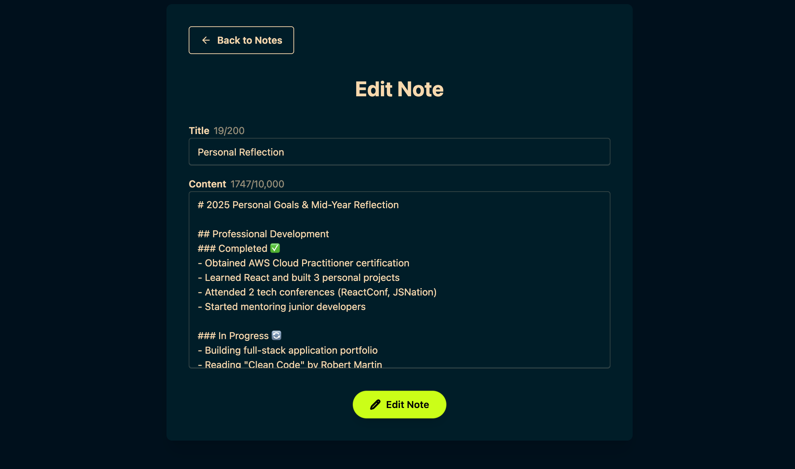
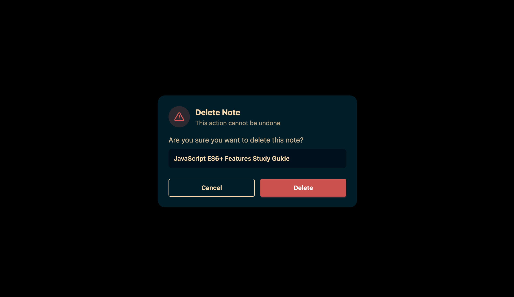

# 🧠 thinkBoard - Your Personal Notes App

<div align="center">
  
  
  
  **A modern, responsive notes application built with React and Node.js**
  
  [](https://opensource.org/licenses/MIT)
  [](https://nodejs.org/)
  [](https://react.dev/)
  [](https://www.mongodb.com/)
  [](https://expressjs.com/)
  
  ---
  
</div>

## ✨ Features

- **📝 Create & Edit Notes**: Simple and intuitive note creation with rich text support
- **🗂️ Organize Content**: Clean card-based layout for easy note management
- **🔍 Responsive Design**: Works seamlessly on desktop and mobile devices
- **⚡ Real-time Updates**: Instant feedback with loading states and notifications
- **🛡️ Rate Limiting**: Built-in API protection with Redis-based rate limiting
- **🎨 Modern UI**: Beautiful interface with Tailwind CSS and DaisyUI
- **🔄 CRUD Operations**: Full create, read, update, and delete functionality
- **📱 Progressive Web App**: Optimized for performance and user experience

## 🚀 Live Demo

[Visit thinkBoard](https://thinkboard-eqev.onrender.com) <!-- Replace with actual demo link -->

## 📸 Screenshots

<div align="center">

### 🏠 Homepage - Notes Overview

*Clean, card-based layout displaying all your notes with consistent sizing and hover effects*

### ✏️ Create New Note

*Intuitive note creation interface with real-time character counting and validation*

### 📝 Edit Note

*Seamless editing experience with pre-populated content and instant feedback*

### 🗑️ Delete Confirmation

*User-friendly confirmation dialog to prevent accidental deletions*

</div>

## 🛠️ Tech Stack

### Frontend
- **React 19.1.0** - UI library
- **React Router 7.6.3** - Client-side routing
- **Tailwind CSS 4.1.11** - Utility-first CSS framework
- **DaisyUI 5.0.43** - Tailwind CSS component library
- **Vite 7.0.0** - Build tool and development server
- **Axios 1.10.0** - HTTP client
- **React Hot Toast 2.5.2** - Toast notifications
- **Lucide React 0.525.0** - Modern icons

### Backend
- **Node.js 18+** - Runtime environment
- **Express.js 5.1.0** - Web framework
- **MongoDB** - Database
- **Mongoose 8.16.1** - MongoDB ODM
- **Upstash Redis** - Rate limiting and caching
- **CORS 2.8.5** - Cross-origin resource sharing
- **dotenv 17.0.1** - Environment variables

## 📋 Prerequisites

Before you begin, ensure you have the following installed:

- **Node.js** (v18 or higher)
- **npm** or **yarn**
- **MongoDB** (local or cloud instance)
- **Redis** (for rate limiting - using Upstash)

## ⚙️ Installation & Setup

### 1. Clone the repository
```bash
git clone https://github.com/yourusername/thinkBoard.git
cd thinkBoard
```

### 2. Backend Setup
```bash
# Navigate to backend directory
cd backend

# Install dependencies
npm install

# Create environment file
cp .env.example .env

# Update .env with your configuration
nano .env
```

**Environment Variables (Backend):**
```env
# Server Configuration
PORT=3000
NODE_ENV=development

# Database Configuration
DATABASE_URL=your_mongodb_connection_string_here

# Upstash Redis Configuration
UPSTASH_REDIS_REST_URL=your_upstash_redis_url_here
UPSTASH_REDIS_REST_TOKEN=your_upstash_redis_token_here

# JWT Secret (for future authentication)
JWT_SECRET=your_jwt_secret_here
```

### 3. Frontend Setup
```bash
# Navigate to frontend directory
cd ../frontend

# Install dependencies
npm install
```

### 4. Start the Development Servers

**Backend:**
```bash
cd backend
npm run dev
```
Server will run on `http://localhost:3000`

**Frontend:**
```bash
cd frontend
npm run dev
```
Client will run on `http://localhost:5173`

## 🌐 API Endpoints

### Notes
- `GET /api/notes` - Get all notes
- `GET /api/notes/:id` - Get specific note
- `POST /api/notes` - Create new note
- `PUT /api/notes/:id` - Update note
- `DELETE /api/notes/:id` - Delete note

### Rate Limiting
- **10 requests per 10 seconds** per IP address
- Returns `429 Too Many Requests` when exceeded

## 📁 Project Structure

```
thinkBoard/
├── backend/                 # Backend application
│   ├── src/
│   │   ├── config/         # Configuration files
│   │   │   ├── db.js       # Database connection
│   │   │   └── upstash.js  # Redis configuration
│   │   ├── controllers/    # Route controllers
│   │   │   └── notesController.js
│   │   ├── middleware/     # Express middleware
│   │   │   ├── rateLimiter.js
│   │   │   └── loggerMiddleware.js
│   │   ├── models/         # Database models
│   │   │   └── Note.js
│   │   ├── routes/         # API routes
│   │   │   └── notesRoutes.js
│   │   └── server.js       # Main server file
│   ├── package.json
│   └── .env
├── frontend/               # Frontend application
│   ├── src/
│   │   ├── components/     # Reusable components
│   │   │   ├── BackButton.jsx
│   │   │   ├── Navbar.jsx
│   │   │   ├── NoteCard.jsx
│   │   │   └── RateLimitedUI.jsx
│   │   ├── pages/          # Page components
│   │   │   ├── CreatePage.jsx
│   │   │   ├── EditNotePage.jsx
│   │   │   ├── HomePage.jsx
│   │   │   └── NoteDetailPage.jsx
│   │   ├── App.jsx         # Main App component
│   │   ├── main.jsx        # Entry point
│   │   └── index.css       # Global styles
│   ├── public/
│   │   ├── favicon.svg     # Custom favicon
│   │   └── index.html      # HTML template
│   ├── package.json
│   └── vite.config.js      # Vite configuration
├── assets/                 # Screenshots and images
│   ├── homepage.png
│   ├── createNotepage.png
│   ├── editnotepage.png
│   └── deletenotepage.png
├── .gitignore
└── README.md
```

## 🔧 Development

### Available Scripts

**Backend:**
- `npm start` - Start production server
- `npm run dev` - Start development server with nodemon

**Frontend:**
- `npm run dev` - Start development server
- `npm run build` - Build for production
- `npm run preview` - Preview production build
- `npm run lint` - Run ESLint

### Code Quality

The project includes:
- **ESLint** for code linting
- **Input validation** on both client and server
- **Error handling** throughout the application
- **Loading states** for better UX
- **Responsive design** for all devices

## 🚦 Usage

1. **Create a Note**: Click the "Create" button in the navbar
2. **View Notes**: All notes are displayed as cards on the homepage
3. **Edit Note**: Click the edit icon on any note card or in note detail view
4. **Delete Note**: Click the delete icon and confirm deletion
5. **View Details**: Click on any note card to see full content

## 🔐 Security Features

- **Rate Limiting**: Prevents API abuse with Redis-based limiting
- **Input Validation**: Server-side validation for all inputs
- **Error Handling**: Proper error responses without exposing sensitive data
- **Environment Variables**: Secure configuration management
- **CORS Protection**: Configured cross-origin resource sharing

## 🎨 UI/UX Features

- **Modern Design**: Clean, minimalist interface
- **Responsive Layout**: Works on all screen sizes
- **Interactive Elements**: Hover effects and animations
- **Loading States**: Visual feedback during operations
- **Toast Notifications**: Success and error messages
- **Empty States**: Helpful messages when no content exists

## 🔄 Future Enhancements

- [ ] **User Authentication**: JWT-based login system
- [ ] **Search Functionality**: Full-text search for notes
- [ ] **Categories/Tags**: Organize notes with tags
- [ ] **Rich Text Editor**: Enhanced text editing capabilities
- [ ] **Dark Mode**: Theme switching
- [ ] **Export/Import**: Backup and restore notes
- [ ] **Collaboration**: Share notes with other users
- [ ] **Mobile App**: React Native version

## 🤝 Contributing

We welcome contributions! Please follow these steps:

1. Fork the repository
2. Create a feature branch (`git checkout -b feature/amazing-feature`)
3. Commit your changes (`git commit -m 'Add amazing feature'`)
4. Push to the branch (`git push origin feature/amazing-feature`)
5. Open a Pull Request

### Development Guidelines

- Follow the existing code style
- Add tests for new features
- Update documentation as needed
- Ensure all tests pass before submitting

## 📝 License

This project is licensed under the MIT License - see the [LICENSE](LICENSE) file for details.

## 🙏 Acknowledgments

- **React Team** for the amazing React library
- **Vite Team** for the lightning-fast build tool
- **Tailwind CSS** for the utility-first CSS framework
- **DaisyUI** for the beautiful component library
- **MongoDB** for the flexible database
- **Upstash** for the serverless Redis service

## 📞 Support

If you have any questions or need help with setup, please:

1. Check the [Issues](https://github.com/yourusername/thinkBoard/issues) page
2. Create a new issue if your problem isn't already listed
3. Provide detailed information about your setup and the issue

---

<div align="center">
  <p>Made with ❤️ by <a href="https://github.com/yashdeeproy">Yashdeep Roy</a></p>
  <p>⭐ Star this repository if you found it helpful!</p>
</div> 